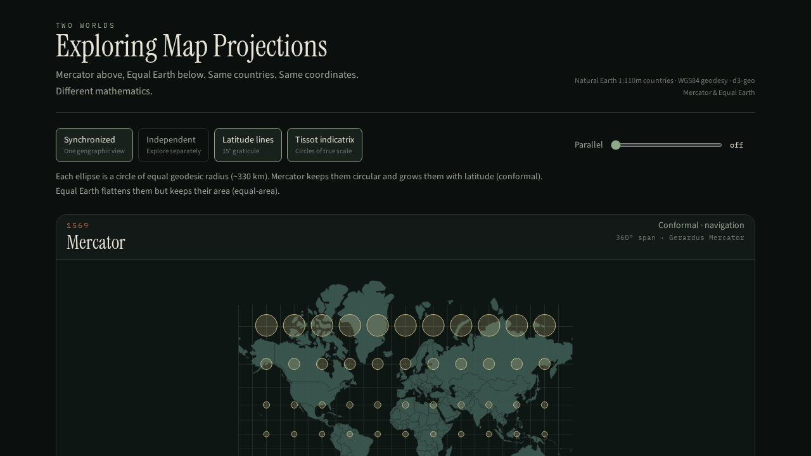
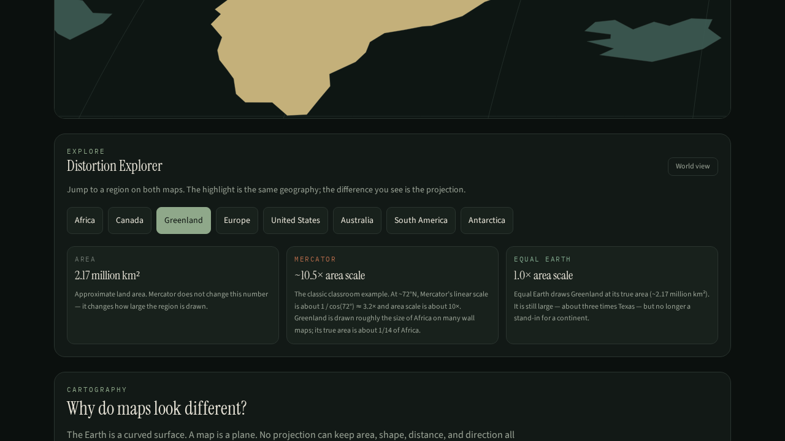

# Two Worlds: Exploring Map Projections

**Open in a browser (no install):** [https://mysicbot.github.io/two-worlds/](https://mysicbot.github.io/two-worlds/)

An educational WebGIS that places **Mercator**, **Equal Earth**, and **Goode Homolosine** on the same page, locked to the same geography. Same countries. Same coordinates. Different mathematics.

The point is not to pick a winner. It is to feel how projection choice changes what a world map is allowed to say.



<p align="center"><em>Tissot’s indicatrix on both maps — circles that grow with latitude on Mercator, ellipses of constant area on Equal Earth.</em></p>



<p align="center"><em>Greenland on Mercator versus Equal Earth. Geographic area does not change. Drawn area does.</em></p>

## Why this exists

Every world map is a compromise. The Earth is curved; the page is flat. A projection can protect area, or local shape, or some distances — never all of them.

Web maps quietly standardize on Web Mercator because it tiles and looks familiar. That is a software convenience, not a statement that Greenland is the size of Africa. GIS analysis inherits the same decision: area statistics computed in EPSG:3857 are wrong; bearing-sensitive work in an equal-area CRS is awkward.

This app makes that trade-off visible instead of burying it in a code.

## Try it

| Do this | What you should notice |
| --- | --- |
| Leave Tissot on | Mercator circles stay round and swell toward the poles; Equal Earth ellipses stay similar in area; Homolosine keeps area and tears the oceans |
| Hover any map | A shared lon/lat crosshair appears on all three projections |
| Open **Greenland** or **Africa** | Same land, wildly different visual weight |
| Open **Asia**, **India**, **China**, or **Japan** | Mid-latitude vs tropical scale on the conformal map |
| Tap a country | Geographic area vs Mercator area-scale \(\sec^2\varphi\) at the centroid — the view does not jump |
| Drag the **Parallel** slider | Graticule spacing stretches on Mercator, stays honest on Equal Earth |
| Switch **Independent** | Explore each projection on its own camera |

Pan and scroll-zoom work on both canvases. **Synchronized** (default) keeps one geographic view.

## What it demonstrates

- Geographic coordinates (lon/lat on WGS84) versus projected coordinates
- **Conformal** Mercator: local angles and rhumb lines held; area scale = \(\sec^2\varphi\)
- **Equal-area** Equal Earth: country sizes comparable; shapes flex; the world stays one piece
- **Equal-area interrupted** Goode Homolosine: same area rule, oceans split so continents keep more of their shape
- Shared **crosshair**: one lon/lat marked on every projection, with Mercator area scale at that latitude
- **Tissot’s indicatrix**: the same geodesic circle (~330 km / 3°) drawn in both projections
- Distortion Explorer for Africa, Canada, Greenland, Europe, Asia, India, China, Japan, United States, Australia, South America, Antarctica
- Synchronized navigation so the same extent is read in two languages at once

## Stack

- React 19 and TanStack Start
- [d3-geo](https://github.com/d3/d3-geo) — `geoMercator`, `geoEqualEarth`, `geoCircle`
- [d3-geo-projection](https://github.com/d3/d3-geo-projection) — `geoInterruptedHomolosine`
- Natural Earth 1:110m admin-0 countries (GeoJSON)
- Canvas rendering — no map-tile vendor, no backend GIS

## Run locally

```bash
git clone https://github.com/mysicbot/two-worlds.git
cd two-worlds
npm install
npm run dev
```

Then open the URL Vite prints. Typecheck with `npm run typecheck`.

## Repository

```
src/lib/projections.ts   Mercator / Equal Earth / Homolosine, view fitting, spherical area
src/lib/tissot.ts        Geodesic circles for the indicatrix
src/lib/geo-view.ts      Shared camera: centre + longitude span
src/lib/regions.ts       Distortion Explorer
src/components/          Maps, explorer, area panel, education copy
public/data/             Natural Earth countries
docs/CARTOGRAPHY.md      Projection math, Tissot, area, citations
docs/ARCHITECTURE.md     How the canvases stay in sync
docs/DATA.md             Natural Earth attribution and limits
```

## Data

- [Natural Earth](https://www.naturalearthdata.com/) `ne_110m_admin_0_countries` — public domain
- Areas in the country panel are spherical estimates from those simplified geometries (authalic radius 6,371 km). They are for teaching relative size, not legal area.

Asia is highlighted as `CONTINENT = Asia`, excluding Russia (Natural Earth classifies Russia as Europe).

## GIS concepts in the interface

| Control | Concept |
| --- | --- |
| Synchronized / Independent | Shared geographic view versus separate exploration |
| Distortion Explorer | Same feature, two projected appearances |
| Country tap | Geographic area vs Mercator area-scale at centroid latitude |
| Tissot indicatrix | Circle of true scale → ellipse of distortion |
| Latitude lines / parallel slider | Graticule spacing: Mercator stretches meridians toward the poles |

Deeper notes: [docs/CARTOGRAPHY.md](docs/CARTOGRAPHY.md).

## License

Code is [MIT](LICENSE). Natural Earth data is public domain. Projections via d3-geo (ISC).

## Application

**Live classroom link (open in any browser):**  
[https://mysicbot.github.io/two-worlds/](https://mysicbot.github.io/two-worlds/)

Source code: [https://github.com/mysicbot/two-worlds](https://github.com/mysicbot/two-worlds)
